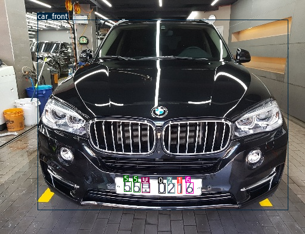
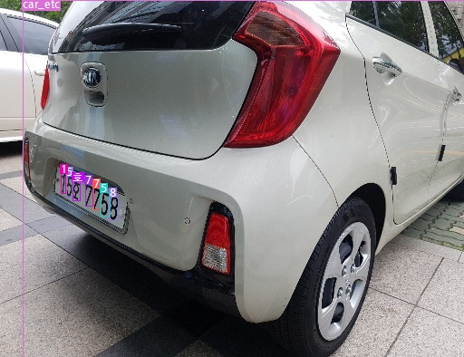
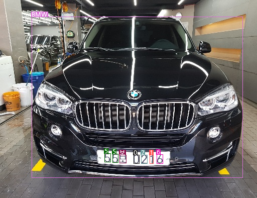

# drawing-yolo-bbox
한글로 bounding box 그리기
drawing bbox with hanguel

## Requirement
* pytorch >= 1.6.0
* Pillow
* opencv-python

## Results
 


## Using with customed yolo
```shell
python detect.py --cfg yolov3-custom.cfg --names class.names --weights yolov3.pt --source sample.png
```

* cfg : yolo config file
* names : yolo class file (ex. coco.names)
* weights : yolo weights file
* source : input image

* cfg파일과 weights 파일은 제공하지 않습니다.
* 학습한 yolo모델의 class명이 한국어일 때 bounding box를 그리기 위한 코드입니다.

## Just draw bbox without yolo

```python
from bounding_box import bounding_box as bbox
import cv2 as cv

img = cv.imread("sample.png")
# bbox.add(img, left, top, right, bottom, label, color(optional))
# or bbox.add(img, xmin, ymin, xmax, ymax, label. color(optional))
bbox.add(img, 298, 308, 305, 325, "1")
bbox.add(img, 266, 308, 277, 325, "0")
bbox.add(img, 238, 308, 251, 324, "보")
bbox.add(img, 281, 308, 293, 325, "2")
bbox.add(img, 312, 307, 324, 325, "6")
bbox.add(img, 208, 305, 220, 322, "5")
bbox.add(img, 224, 306, 235, 323, "5", "green")
bbox.add(img, 63, 33, 483, 353, "BMW")

cv.imwrite("outputs/sample_output.png", img)
```

* color 선택 가능, 미입력시 랜덤 컬러

```
color_list = navy, blue, aqua, teal, olive, 
            green, lime, yellow, orange, red, 
            maroon, fuchsia, purple, black, gray, 
            red2, palegreen, purple2, purple3, orchid, 
            slateblue, orchid2, violet, indigo, violet2
```

* result



### If error
* command 상에서 한글 출력시 발생 가능한 오류 

```shell
UnicodeEncodeError: 'ascii' codec can't encode character '\ubcf4' in position 54: ordinal not in range(128)
```

* resolve
```shell
export PYTHONIOENCODING='utf-8'
```

### reference
* PyPI bounding_box repo : https://pypi.org/project/bounding-box/
* yolov3 repo : https://github.com/ultralytics/yolov3
